# 📝 Blog App

A modern production-style mobile Blog Application built with **Flutter + Dart + GetX**, integrated with a RESTful API backend.

The application provides user authentication, blog post management, image upload, comments, profile management, search, notifications, and theme support.

---

## 📱 Project Overview

**Blog App** is a mobile application developed as a Flutter assignment project.

The main purpose of this project is to demonstrate how to build a real-world Flutter application using:

- Flutter
- Dart
- GetX
- GetX Controller
- GetX Binding
- GetX Routing
- Dio
- REST API
- Token-based Authentication
- Local Storage
- Multipart Image Upload
- Form Validation
- Firebase Notifications
- Responsive UI
- Error Handling
- Loading and Empty States

The application communicates with a Laravel REST API backend instead of using hardcoded data.

---

## 🎯 Assignment Objectives

The project implements the following major requirements:

- User registration
- User login
- Token-based authentication
- Current user information
- User logout
- Blog post listing
- Blog post details
- Create blog post
- Image upload
- Edit blog post
- Delete blog post
- Comments
- Search posts
- Pull-to-refresh
- Loading states
- Empty states
- Error states
- Confirmation dialogs
- Snackbar feedback
- Local authentication storage
- Firebase/local notifications
- Dark/light theme support

---

# 🛠️ Technologies Used

| Technology | Purpose |
|---|---|
| Flutter | Mobile application framework |
| Dart | Programming language |
| GetX | State management, dependency injection and navigation |
| Dio | REST API communication |
| Laravel API | Backend REST API |
| GetStorage | Local token/data storage |
| Firebase | Push notification integration |
| Image Picker | Selecting images from gallery/camera |
| REST API | Client-server communication |
| Git | Version control |
| GitHub | Source code hosting |

---

# 📌 Flutter Environment

This project was developed using:

```text
Flutter: 3.41.7
Dart: 3.11.5
```

Check your installed versions:

```bash
flutter --version
dart --version
```

---

# 🏗️ Application Architecture

The project follows a feature-based architecture using GetX.

The general data flow is:

```text
┌──────────────┐
│     View     │
└──────┬───────┘
       │
       ▼
┌──────────────┐
│  Controller  │
└──────┬───────┘
       │
       ▼
┌──────────────┐
│   Provider   │
└──────┬───────┘
       │
       ▼
┌──────────────┐
│  API Service │
└──────┬───────┘
       │
       ▼
┌──────────────┐
│ Laravel REST │
│      API     │
└──────────────┘
```

The response is then returned through the same layers:

```text
Laravel API
    ↓
API Service
    ↓
Provider
    ↓
Controller
    ↓
Reactive State
    ↓
View
```

This keeps API and business logic outside the UI.

---

# 📂 Project Structure

```text
lib/
│
├── firebase_options.dart
├── main.dart
│
├── app/
│   │
│   ├── bindings/
│   │   ├── app_bindings.dart
│   │   └── initial_binding.dart
│   │
│   ├── config/
│   │   ├── api_endpoints.dart
│   │   └── app_config.dart
│   │
│   ├── constants/
│   │   └── app_colors.dart
│   │
│   ├── data/
│   │   │
│   │   ├── models/
│   │   │   ├── comment_model.dart
│   │   │   ├── post_model.dart
│   │   │   └── user_model.dart
│   │   │
│   │   ├── providers/
│   │   │   ├── auth_provider.dart
│   │   │   ├── comment_provider.dart
│   │   │   └── post_provider.dart
│   │   │
│   │   └── services/
│   │       ├── api_service.dart
│   │       └── storage_service.dart
│   │
│   ├── modules/
│   │   │
│   │   ├── auth/
│   │   │   ├── bindings/
│   │   │   │   └── auth_binding.dart
│   │   │   ├── controllers/
│   │   │   │   └── auth_controller.dart
│   │   │   └── views/
│   │   │       ├── auth_view.dart
│   │   │       ├── login_view.dart
│   │   │       └── register_view.dart
│   │   │
│   │   ├── comments/
│   │   │   ├── bindings/
│   │   │   │   └── comments_binding.dart
│   │   │   ├── controllers/
│   │   │   │   └── comments_controller.dart
│   │   │   └── views/
│   │   │       └── comments_view.dart
│   │   │
│   │   ├── home/
│   │   │   ├── bindings/
│   │   │   │   └── home_binding.dart
│   │   │   ├── controllers/
│   │   │   │   └── home_controller.dart
│   │   │   ├── views/
│   │   │   │   └── home_view.dart
│   │   │   └── widget/
│   │   │
│   │   ├── posts/
│   │   │   ├── bindings/
│   │   │   │   └── posts_binding.dart
│   │   │   ├── controllers/
│   │   │   │   └── posts_controller.dart
│   │   │   └── views/
│   │   │       ├── create_post_view.dart
│   │   │       ├── posts_view.dart
│   │   │       ├── post_delete.dart
│   │   │       ├── post_details_view.dart
│   │   │       └── post_edit_view.dart
│   │   │
│   │   ├── profile/
│   │   │   ├── bindings/
│   │   │   │   └── profile_binding.dart
│   │   │   ├── controllers/
│   │   │   │   └── profile_controller.dart
│   │   │   └── views/
│   │   │       └── profile_view.dart
│   │   │
│   │   ├── splash/
│   │   │   ├── bindings/
│   │   │   │   └── splash_binding.dart
│   │   │   ├── controllers/
│   │   │   │   └── splash_controller.dart
│   │   │   └── views/
│   │   │       └── splash_view.dart
│   │   │
│   │   └── theme/
│   │       └── controllers/
│   │           └── theme_controller.dart
│   │
│   ├── routes/
│   │   ├── app_pages.dart
│   │   └── app_routes.dart
│   │
│   ├── services/
│   │   ├── firebase_notification_service.dart
│   │   └── notification_service.dart
│   │
│   ├── utils/
│   │   ├── extensions.dart
│   │   ├── helpers.dart
│   │   ├── response_helper.dart
│   │   └── validators.dart
│   │
│   └── widget/
│       ├── empty_state.dart
│       ├── error_state.dart
│       ├── loading_shimmer.dart
│       ├── post_card.dart
│       ├── post_image_section.dart
│       └── search_widget.dart
```

---

# 🔐 Authentication

The application implements token-based authentication.

## Register

Endpoint:

```http
POST /api/register
```

Registration form contains:

- Name
- Email
- Password
- Password confirmation

Validation is performed before submitting the request.

After successful registration, the application authenticates the user and navigates to the main application.

---

## Login

Endpoint:

```http
POST /api/login
```

The login screen contains:

- Email
- Password
- Login button

After successful login:

```text
Login
  ↓
API Request
  ↓
Receive Token
  ↓
Save Token Locally
  ↓
Load Current User
  ↓
Home
```

The authentication token is automatically used for authenticated API requests.

Example:

```http
Authorization: Bearer {token}
```

---

# 👤 Current User / Profile

Endpoint:

```http
GET /api/current-user
```

The Profile screen displays the authenticated user's information.

Example:

```text
Profile
-------------------------
Profile Image

Name
Chhorn Pithak

Email
example@email.com

-------------------------
Logout
```

The profile feature is implemented using:

```text
ProfileView
     ↓
ProfileController
     ↓
AuthProvider / API Service
     ↓
Laravel API
```

---

# 🚪 Logout

Endpoint:

```http
POST /api/logout
```

Logout performs the following:

1. Calls the logout API.
2. Removes the authentication token.
3. Clears stored user information.
4. Clears application authentication state.
5. Navigates back to Login.

Flow:

```text
Profile
   ↓
Logout
   ↓
Logout API
   ↓
Clear Token
   ↓
Clear User
   ↓
Login
```

---

# 📝 Post Management

The application provides complete post management functionality.

## Get Posts

Endpoint:

```http
GET /api/posts
```

The Home/Post List screen displays:

- Post image
- Post title
- Author
- Created date
- Post actions

The post list supports:

- Loading state
- Empty state
- Error state
- Pull-to-refresh
- Search
- Delete
- Post details

---

# ➕ Create Post

Endpoint:

```http
POST /api/posts
```

The request uses:

```text
multipart/form-data
```

Fields:

| Field | Type |
|---|---|
| image | File |
| title | Text |
| user_id | Text |

The Create Post screen provides:

1. Image selection
2. Image preview
3. Title input
4. Form validation
5. Upload progress/loading
6. API error handling
7. Success feedback
8. Post list refresh

Flow:

```text
Create Post
     ↓
Select Image
     ↓
Preview Image
     ↓
Enter Title
     ↓
Validate Form
     ↓
Multipart Upload
     ↓
Laravel API
     ↓
Success
     ↓
Refresh Posts
```

---

# 🖼️ Image Handling

The application supports displaying images received from the API.

The reusable:

```text
post_image_section.dart
```

widget is responsible for handling post images.

Image states include:

- Loading
- Successful image loading
- Missing image
- Invalid image
- Network error
- Placeholder

This prevents broken image URLs from damaging the UI.

---

# 📄 Post Details

The Post Details screen displays complete information about a selected post.

Example:

```text
┌──────────────────────────┐
│                          │
│       POST IMAGE         │
│                          │
└──────────────────────────┘

Post Title

By: Author

Created: 20 Aug 2026

Post information

--------------------------

Comments
```

Users can navigate from a post to its comments.

---

# ✏️ Edit Post

The application also contains:

```text
post_edit_view.dart
```

This provides an interface for editing an existing post when the backend API supports the required operation.

The edit screen can update post information and refresh the post list after a successful operation.

---

# 🗑️ Delete Post

Delete endpoint:

```http
DELETE /api/posts/{id}
```

Before deletion, the application displays a confirmation dialog.

Example:

```text
Are you sure you want to delete this post?

        Cancel     Delete
```

After successful deletion:

```text
API Delete
    ↓
Remove Post
    ↓
Update Reactive List
    ↓
Refresh UI
    ↓
Show Success Message
```

The deleted post is removed from the UI without requiring the user to restart the application.

---

# 💬 Comments

The Comments module is responsible for retrieving and displaying comments.

The application includes:

```text
CommentModel
CommentProvider
CommentsController
CommentsBinding
CommentsView
```

Comments display information such as:

- User
- Comment content
- Date/time when available

Example:

```text
Comments

👤 John
Great post! 👍

👤 Dara
Very useful article.

👤 Alex
Thanks for sharing!
```

If the API provides only GET comments, the application focuses on displaying the available comments.

---

# 🔎 Search

The application includes a reusable:

```text
search_widget.dart
```

Search allows users to find posts more easily.

The search functionality is integrated with the post list and controller state.

---

# 🔄 Pull to Refresh

The Home/Post List supports pull-to-refresh.

Users can swipe down on the post list to request the latest posts from the API.

```text
User pulls down
      ↓
GET /api/posts
      ↓
Update posts
      ↓
Refresh UI
```

---

# ⏳ Loading States

The application provides loading feedback during API operations.

Reusable loading components include:

```text
loading_shimmer.dart
```

Loading states are used for:

- Loading posts
- Login
- Registration
- Profile loading
- Image loading
- Creating posts
- Deleting posts
- Refreshing data

---

# 📭 Empty States

When the API returns no posts or comments, the application displays an appropriate empty state.

Reusable component:

```text
empty_state.dart
```

Example:

```text
No posts found

There are currently no posts available.
```

---

# ❌ Error Handling

The application handles API and UI errors using:

```text
error_state.dart
response_helper.dart
helpers.dart
```

Possible errors include:

- Network connection failure
- Invalid credentials
- Validation errors
- Unauthorized requests
- Server errors
- Image loading failures
- Empty API responses

Users receive feedback through appropriate UI messages such as Snackbars, dialogs, and error states.

---

# 🧠 GetX Architecture

GetX is used throughout the application for:

- State management
- Dependency injection
- Navigation
- Controllers
- Bindings
- Reactive UI

## Controllers

The application contains dedicated controllers for different features.

```text
AuthController
PostsController
HomeController
CommentsController
ProfileController
SplashController
ThemeController
```

This prevents business logic from being placed directly inside Widgets.

---

# 🔗 GetX Bindings

Each major module has its own Binding.

Examples:

```text
AuthBinding
HomeBinding
PostsBinding
CommentsBinding
ProfileBinding
SplashBinding
AppBindings
InitialBinding
```

Bindings are responsible for injecting dependencies when a route is opened.

Example architecture:

```text
Route
  ↓
Binding
  ↓
Controller
  ↓
Provider
  ↓
API Service
```

---

# 🧭 Navigation

Application routes are centralized inside:

```text
app/routes/app_routes.dart
app/routes/app_pages.dart
```

Main navigation includes:

```text
Splash
  ↓
Login / Home
```

Application routes include:

```text
/login
/register
/home
/posts
/posts/create
/posts/details
/posts/edit
/comments
/profile
```

The exact route names are defined in the project's `app_routes.dart`.

---

# 💾 Local Storage

Authentication information is stored locally using the application's storage service.

Main service:

```text
app/data/services/storage_service.dart
```

The token is stored after successful authentication.

Application startup checks whether a token exists.

```text
Application Start
       ↓
Check Token
       ↓
 ┌─────┴─────┐
 │           │
YES          NO
 │           │
 ▼           ▼
Home       Login
```

This allows authenticated users to remain logged in between application launches.

---

# 🌐 API Layer

API communication is separated from the UI.

Main API components:

```text
app/data/services/api_service.dart

app/data/providers/auth_provider.dart
app/data/providers/post_provider.dart
app/data/providers/comment_provider.dart
```

The API layer is responsible for:

- HTTP requests
- Authentication headers
- Multipart requests
- API responses
- Error handling
- Request configuration

Dio is used as the HTTP client.

---

# ⚙️ API Configuration

API configuration is centralized in:

```text
app/config/app_config.dart
```

API endpoint definitions are centralized in:

```text
app/config/api_endpoints.dart
```

This prevents API URLs from being scattered throughout the application.

Before running the project, make sure the API base URL points to the correct Laravel backend.

Example:

```dart
static const String baseUrl = 'http://127.0.0.1:8000';
```

For an Android emulator, the Laravel server may need to be accessed through:

```text
http://10.0.2.2:8000
```

depending on the development environment.

---

# 🔔 Notifications

The project includes notification services:

```text
notification_service.dart
firebase_notification_service.dart
```

Firebase configuration is included through:

```text
firebase_options.dart
```

Notifications can be used to provide feedback or support future push notification functionality.

---

# 🎨 UI / UX

The application uses a modern Blog App interface designed around:

- Clean layouts
- Consistent colors
- Reusable components
- Rounded cards
- Image previews
- Clear typography
- Loading feedback
- Empty states
- Error states
- Confirmation dialogs
- Snackbars
- Responsive layouts

Application colors are centralized in:

```text
app/constants/app_colors.dart
```

This makes the visual design easier to maintain.

---

# 🌓 Theme Support

The application includes a theme controller:

```text
theme/controllers/theme_controller.dart
```

This provides the foundation for light and dark mode support.

The theme state can be changed without placing theme logic directly inside individual screens.

---

# 🧩 Reusable Widgets

The project contains reusable widgets:

```text
empty_state.dart
error_state.dart
loading_shimmer.dart
post_card.dart
post_image_section.dart
search_widget.dart
```

These widgets reduce duplicated UI code and make the application easier to maintain.

For example:

```text
Post List
   ↓
PostCard
   ↓
PostImageSection
```

---

# 🔒 Security

The application uses token-based authentication.

Authenticated requests include:

```http
Authorization: Bearer {token}
```

The authentication token should not be hardcoded into the source code.

API credentials and sensitive configuration should also not be committed to GitHub.

---

# 🚀 Installation

## 1. Clone the Repository

```bash
git clone YOUR_GITHUB_REPOSITORY_URL
```

Move into the project directory:

```bash
cd blog_app
```

---

## 2. Install Dependencies

Run:

```bash
flutter pub get
```

---

## 3. Check Flutter Environment

Run:

```bash
flutter doctor
```

Make sure the required Android/iOS development environment is configured.

---

# ▶️ Run the Application

Connect an Android device or start an Android emulator.

Then run:

```bash
flutter run
```

To see available devices:

```bash
flutter devices
```

To run on a specific device:

```bash
flutter run -d DEVICE_ID
```

---

# 🔌 Backend Setup

This Flutter application requires the Laravel REST API backend.

Start the Laravel backend:

```bash
php artisan serve
```

The default development URL is:

```text
http://127.0.0.1:8000
```

Make sure the Flutter application API configuration matches the backend address.

For Android Emulator:

```text
http://10.0.2.2:8000
```

For a physical Android device, use the computer's local network IP address, for example:

```text
http://192.168.x.x:8000
```

The phone and computer must be connected to the same network.

---

# 🧪 API Testing

The API can be tested using Postman before connecting it to Flutter.


**Postman Collection:** [Open Postman Collection](https://chounpithaks-team.postman.co/workspace/My-Workspace~7dfdf271-9c38-49ca-8907-bfef6c143b90/collection/47854027-14523002-5908-4fb9-85c6-9e4620fbb823?action=share&source=copy-link&creator=47854027)

Main API operations:

```text
POST    /api/register
POST    /api/login
GET     /api/current-user
POST    /api/logout

GET     /api/posts
POST    /api/posts
DELETE  /api/posts/{id}

GET     comments
```

Additional endpoints such as post update can be used when supported by the backend.

---

# 📋 Main Features

| Feature | Status |
|---|:---:|
| Splash Screen | ✅ |
| Register | ✅ |
| Login | ✅ |
| Token Authentication | ✅ |
| Local Token Storage | ✅ |
| Current User | ✅ |
| Profile | ✅ |
| Logout | ✅ |
| Get Posts | ✅ |
| Post Details | ✅ |
| Create Post | ✅ |
| Image Upload | ✅ |
| Image Preview | ✅ |
| Delete Post | ✅ |
| Edit Post | ✅ |
| Comments | ✅ |
| Search | ✅ |
| Pull to Refresh | ✅ |
| Loading State | ✅ |
| Empty State | ✅ |
| Error State | ✅ |
| Confirmation Dialog | ✅ |
| Snackbar Feedback | ✅ |
| Theme Controller | ✅ |
| Local Notifications | ✅ |
| Firebase Notifications |  |

---

# 📸 Screenshots

Add your application screenshots here before submitting the project.

### 🚀 Splash Screen

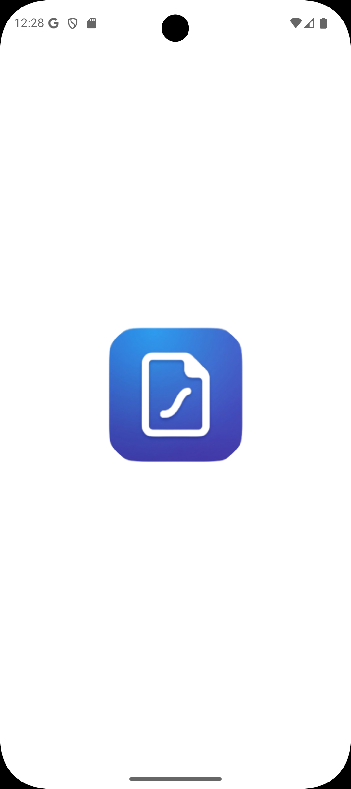

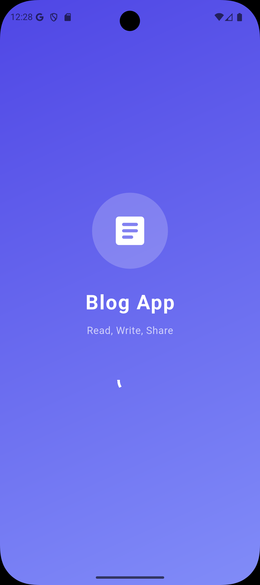

### 🔐 Authentication

#### Login

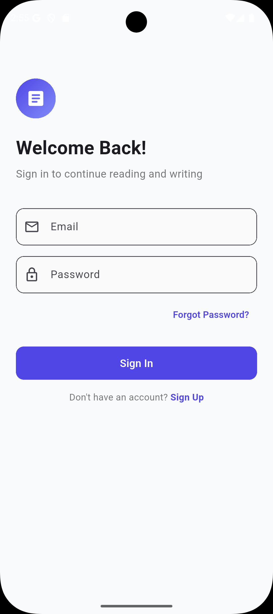

#### Register

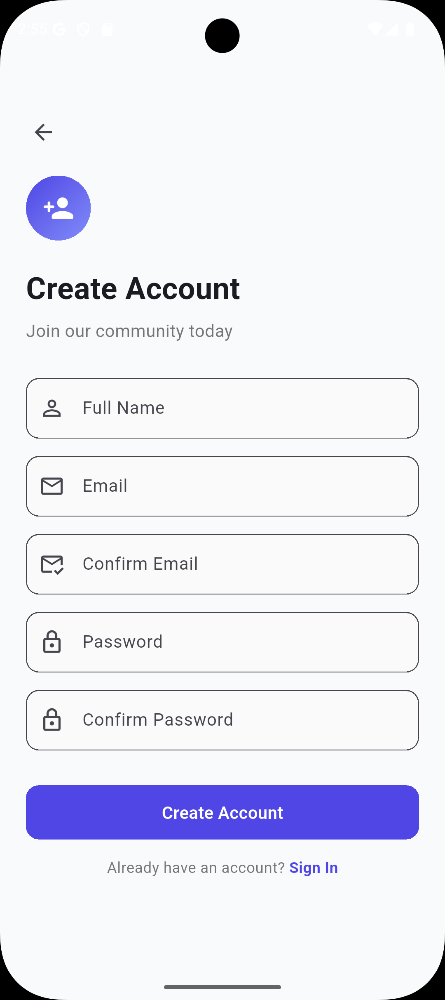

### 🏠 Home

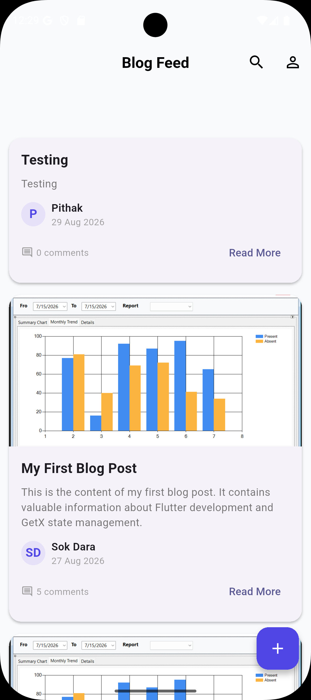

### 🔎 Search

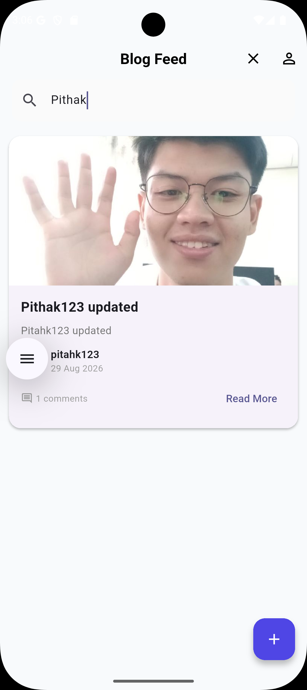

### 📝 Create Post

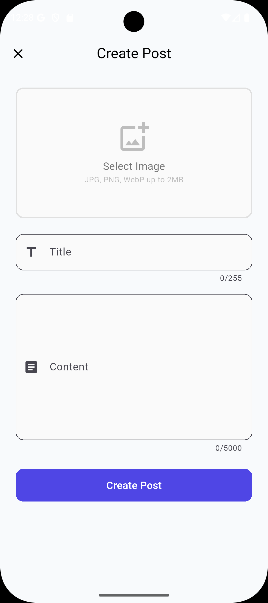

### 📄 Post Details

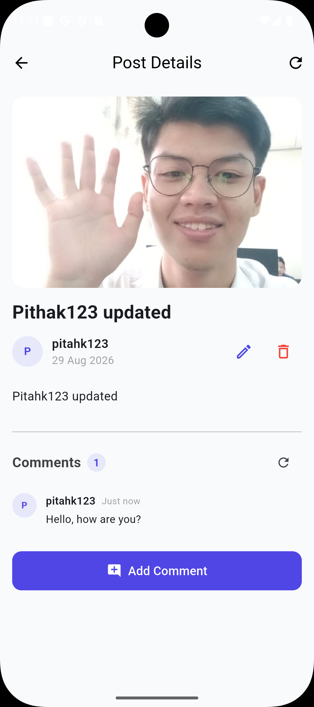

### 💬 Comments

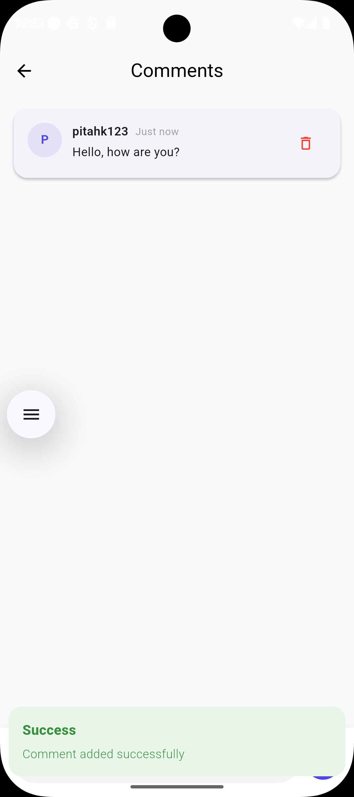

### 📭 No Comments State

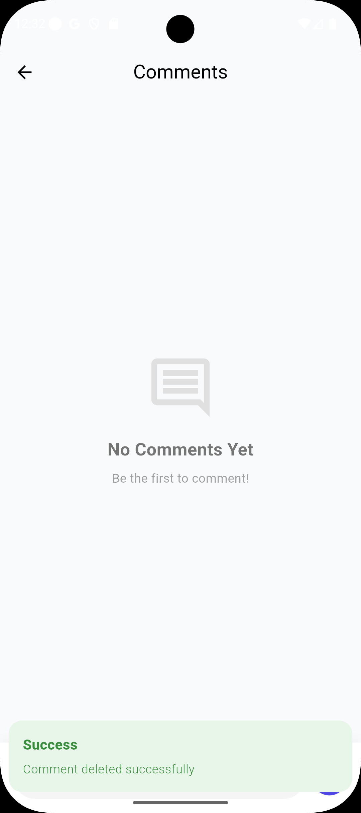

### 👤 Profile

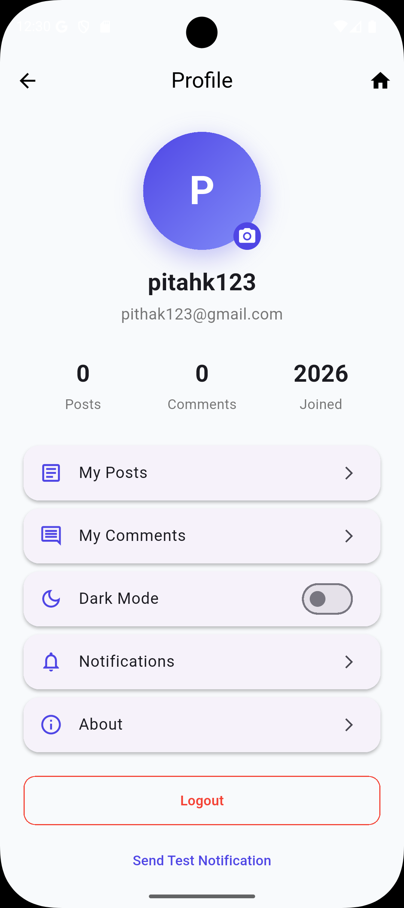

### 🔔 Notification

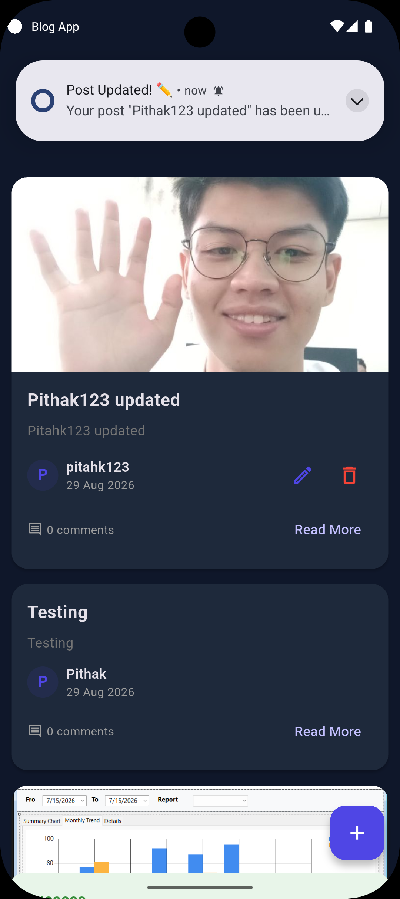

### ⏳ Loading State

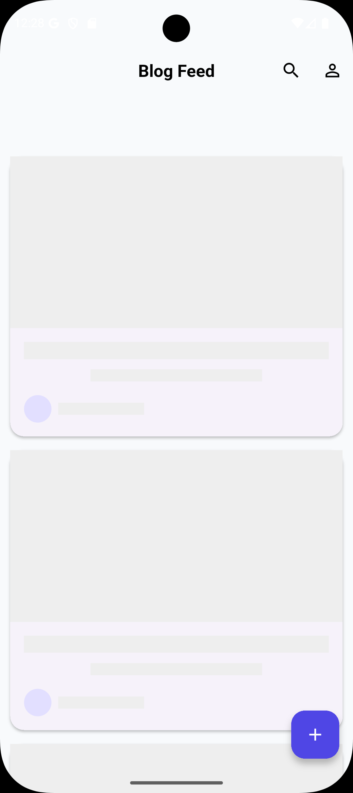

### ❌ Error State

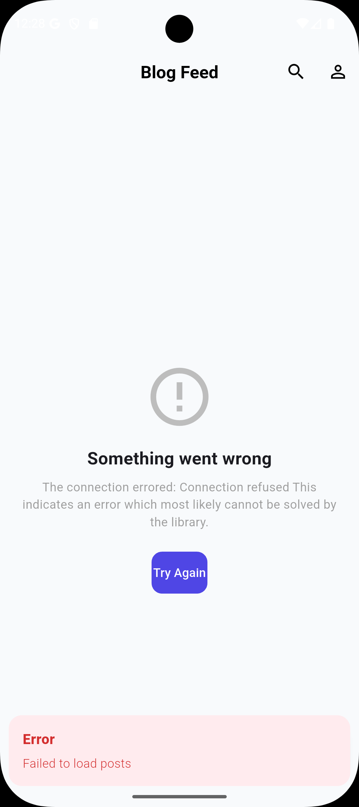

---

# 🎥 Demo Video

The demo video should be approximately **3–5 minutes**.

Recommended demonstration sequence:

```text
1. Open Application
2. Register
3. Login
4. View Home
5. View Current User / Profile
6. View Posts
7. Open Post Details
8. View Comments
9. Create Post
10. Select Image
11. Upload Post
12. View New Post
13. Delete Post
14. Logout
```

**Demo Video:** [Watch on YouTube](https://youtu.be/m7KKwFBxAx8)

**Presentation Video:** [Watch on YouTube](https://youtu.be/m7KKwFBxAx8)

---

# 🧑‍💻 Student Information

| Information | Details |
|---|---|
| Student Name | Chhorn Pithak |
| Project Name | Blog App |
| Platform | Android / iOS |
| Framework | Flutter |
| Language | Dart |
| State Management | GetX |
| HTTP Client | Dio |
| Backend | Laravel REST API |
| Database | Laravel Backend Database |
| Notifications | Firebase / Local Notifications |

---

# 📚 Learning Outcomes

This project demonstrates practical knowledge of:

### Flutter

- Widget development
- Navigation
- Forms
- Image handling
- Responsive UI
- Async programming
- API integration

### Dart

- Classes
- Models
- Futures
- Async/Await
- Null safety
- Collections
- Exception handling

### GetX

- Reactive state management
- Controllers
- Bindings
- Dependency injection
- Route management
- Observable variables

### REST API

- GET
- POST
- DELETE
- Authentication
- Bearer tokens
- Multipart form-data
- JSON responses
- API error handling

### Software Architecture

The project separates:

```text
UI
 ↓
Controller
 ↓
Provider
 ↓
Service
 ↓
API
```

This makes the application easier to maintain, test, and extend.

---

# 📈 Future Improvements

Possible future improvements include:

- Like posts
- Pagination
- Advanced search
- Post categories
- User avatars
- Comment creation
- Comment deletion
- Social sharing
- Camera integration
- Offline caching
- Better notification handling
- Unit testing
- Widget testing
- Integration testing

---

# 🐛 Troubleshooting

## Flutter dependencies

If dependencies are not installed correctly:

```bash
flutter clean
flutter pub get
```

Then run:

```bash
flutter run
```

---

## Check Flutter setup

```bash
flutter doctor -v
```

---

## Check connected devices

```bash
flutter devices
```

---

## Android build problem

Try:

```bash
flutter clean
flutter pub get
flutter run
```

If the problem is related to Gradle or Android SDK, verify the Android development environment with:

```bash
flutter doctor -v
```

---

# 📄 Assignment Requirements Mapping

This project maps to the assignment requirements as follows:

| Assignment Requirement | Implementation |
|---|---|
| Flutter | Flutter 3.41.7 |
| Dart | Dart 3.11.5 |
| GetX | Controllers, Bindings, Routing |
| Dio | API communication |
| Register | Auth module |
| Login | Auth module |
| Token Authentication | Storage + API Service |
| Current User | Profile module |
| Logout | Auth Controller |
| Get Posts | Posts/Home modules |
| Create Post | Create Post View |
| Image Upload | Multipart request |
| Delete Post | Post delete feature |
| Post Image | Post Image Section |
| Comments | Comments module |
| Loading State | Loading Shimmer |
| Empty State | Empty State Widget |
| Error State | Error State Widget |
| Pull to Refresh | Home/Post List |
| Search | Search Widget |
| GetX Binding | Feature Bindings |
| Local Storage | Storage Service |
| Notifications | Firebase + Local Notification Services |
| UI/UX | Reusable styled components |

---

# 📜 License

This project was developed for educational and assignment purposes.

---

# 👨‍💻 Author

**Chhorn Pithak**

Flutter Developer | Full Stack Developer | UI/UX Designer

---

## ⭐ Project Summary

The Blog App is a production-style Flutter application that demonstrates the complete flow of a modern mobile application:

```text
Authentication
      ↓
Token Management
      ↓
REST API Integration
      ↓
GetX State Management
      ↓
Post Management
      ↓
Image Upload
      ↓
Comments
      ↓
Profile
      ↓
Notifications
      ↓
Logout
```

The project is structured to keep the UI, business logic, API communication, models, services, and dependency injection separated.

This architecture makes the application easier to maintain and provides a solid foundation for adding additional features in the future.